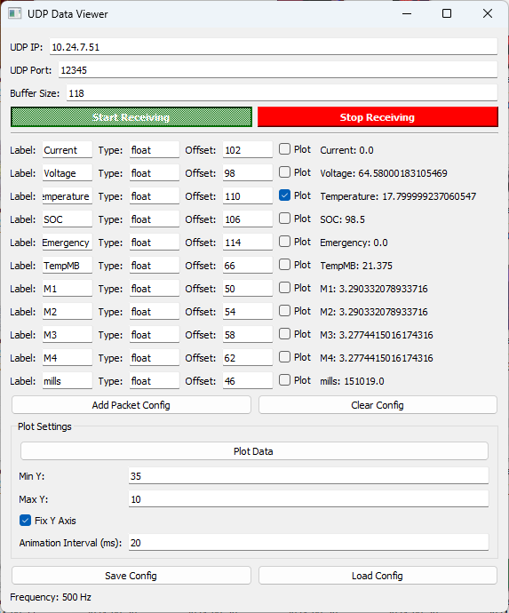
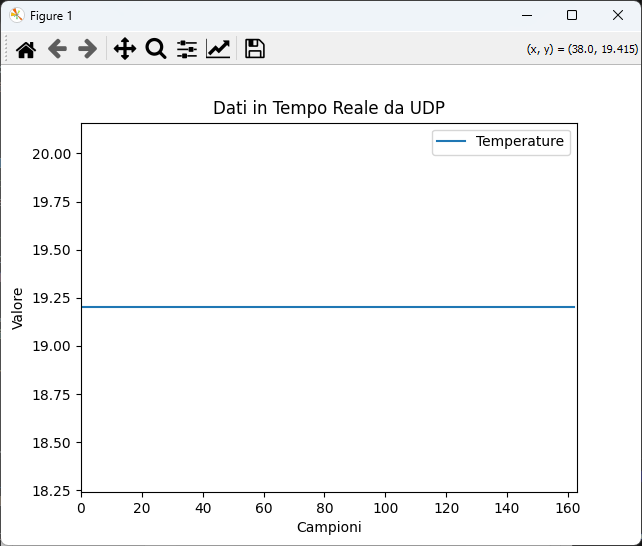

# UDP Packet Receiver Decode

**UDP Packet Receiver Decode** is a Python-based GUI application designed to receive, process, and visualize UDP packets. It allows for configurable packet decoding, real-time data visualization, and dynamic settings adjustments.

 
 

## Features
- **UDP Data Reception**: Connect to a UDP stream by configuring IP, port, and buffer size.
- **Dynamic Packet Decoding**: Configure packet fields (label, type, offset) for real-time data extraction.
- **Real-Time Plotting**: Visualize selected fields dynamically with adjustable Y-axis and animation intervals.
- **Save/Load Configuration**: Export and import configurations as JSON files.


---

## Installation

1. Clone the repository:
   ```bash
   git clone https://github.com/your-username/udp-packet-receiver-decode.git
2. Navigate to the folder:
    ```bash
    cd udp-packet-receiver-decode
3. Install the dependencies:
     ```bash
    pip install PyQt5 matplotlib
4. Run the application:
    ```bash
    python udp_packet_receiver_decode.py

# Usage

## 1. Configure UDP Settings
- **UDP IP**: The IP address of the UDP stream.
- **UDP Port**: The port number for incoming data.
- **Buffer Size**: The size of the data packets to process.

## 2. Define Packet Configuration
- Add a new packet field using the **"Add Packet Config"** button.
- Configure:
  - **Label**: A descriptive name for the field.
  - **Type**: The data type (e.g., `float`, `int`, `string`, etc.).
  - **Offset**: The byte offset of the field in the packet.
  - **Plot Checkbox**: Enable plotting for this field.

## 3. Start Receiving Data
- Click **Start Receiving** to begin processing incoming UDP packets.
- The parsed data will display in the interface with real-time updates.

## 4. Plot Data
- Enable plotting for desired fields using the checkboxes.
- Configure Y-axis limits and animation intervals.
- Click **Plot Data** to open a real-time visualization.


## 5. Save and Load Configurations
- Use the **Save Config** button to export your packet configuration as a JSON file.
- Use the **Load Config** button to import configurations.

---

# Supported Data Types

The following data types are supported for packet parsing:

- **Integers**: `int_8`, `int_16`, `int_32`, `int_64`, `uint_8`, `uint_16`, `uint_32`, `uint_64`
- **Floating Points**: `float`, `double`
- **Characters**: `char`
- **Strings**: `string`
- **Booleans**: `bool`
- **Timestamps**: `timestamp`
- **BCD (Binary-Coded Decimal)**: `bcd`
- **Bit Fields**: `bit_<index>` (e.g., `bit_0` for the first bit of a byte)

---

# Example

## Configuration Example
Define a packet with the following structure:
- **Label**: `Temperature`
- **Type**: `float`
- **Offset**: `0`

## Live Plot
Enable the checkbox for `Temperature` and click **Plot Data** to see real-time temperature changes.

---

# Contributing

Contributions are welcome! Please fork this repository and submit a pull request for any enhancements or bug fixes.

